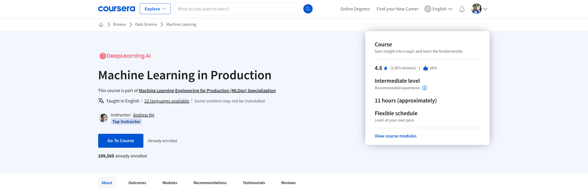

# Machine Learning in Production

[Curso](https://www.coursera.org/learn/introduction-to-machine-learning-in-production?specialization=machine-learning-engineering-for-production-mlops?utm_source=deeplearning-ai&utm_medium=institutions)

En este curso, aprenderás:

- Identifique los componentes clave del ciclo de vida del proyecto de ML, canalice y seleccione los mejores patrones de despliegue y supervisión para diferentes escenarios de producción.

- Optimice el rendimiento y las métricas del modelo dando prioridad a los ejemplos desproporcionadamente importantes que representan trozos clave de un conjunto de datos.

- Resuelva los retos de producción relacionados con los datos estructurados, no estructurados, pequeños y grandes, cómo la coherencia de las etiquetas es esencial y cómo puede mejorarla.

En este curso de Aprendizaje automático en producción, desarrollarás tu intuición sobre el diseño de un sistema de ML de producción 
de principio a fin: alcance del proyecto, necesidades de datos, estrategias de modelado y tecnologías y patrones de implementación. 

Aprenderá estrategias para abordar retos comunes en producción, como establecer una línea base del modelo, abordar la deriva 
del concepto y realizar análisis de errores. Seguirá un marco de trabajo para desarrollar, desplegar y mejorar continuamente una aplicación ML en producción. 
Comprender los conceptos de aprendizaje automático y aprendizaje profundo es esencial, pero si está buscando construir una carrera efectiva en IA, 
también necesita experiencia preparando sus proyectos para el despliegue. 

La ingeniería de aprendizaje automático para la producción combina los conceptos fundamentales del aprendizaje automático con las habilidades y 
las mejores prácticas del desarrollo de software moderno necesarias para implementar y mantener con éxito los sistemas de ML en entornos del mundo real. 

- Semana 1: Visión general del ciclo de vida y despliegue de ML 
- Semana 2: Selección y entrenamiento de un modelo 
- Semana 3: Definición de datos y línea de base

# INDEX 0
- [The Machine Learning Project Lifecycle](#the-machine-learning-project-lifecycle)
- [Deployment](#deployment)
- [Deploying a Deep Learning Model (Assessment 1)](#deploying-a-deep-learning-model-assessment-1)
- [Selecting and Training a Model](#selecting-and-training-a-model)
- [Error analysis and performance auditing](#error-analysis-and-performance-auditing)
- [Data iteration](#data-iteration)
- [Modeling challenges (Assessment 2)](#modeling-challenges-assessment-2)
- [Define Data and Establish Baseline](#define-data-and-establish-baseline)
- [Label and Organize Data](#label-and-organize-data)
- [Scoping](#scoping)
- [The Machine Learning Project Lifecycle (Assessment 3)](#the-machine-learning-project-lifecycle-assessment-3)

# The Machine Learning Project Lifecycle
[<- Return to INDEX 0](#index-0)

## INDEX 1
- [Welcome](#welcome)
- [Steps of an ML project](#steps-of-an-ml-project)
- [Case study: speech recognition](#case-study-speech-recognition)
- [Course outline](#course-outline)
- [Intake Survey](#intake-survey)
- [Important: have questions, issues or ideas? Join our Forum](#important-have-questions-issues-or-ideas-join-our-forum)

## Welcome
[<- Return to INDEX 1](#index-1)

## Steps of an ML project
[<- Return to INDEX 1](#index-1)

## Case study: speech recognition
[<- Return to INDEX 1](#index-1)

## Course outline
[<- Return to INDEX 1](#index-1)

## Intake Survey
[<- Return to INDEX 1](#index-1)

## Important: have questions, issues or ideas? Join our Forum
[<- Return to INDEX 1](#index-1)

# Deployment
[<- Return to INDEX 0](#index-0)

## INDEX 2
- [Key challenges](#key-challenges)
- [Deployment patterns](#deployment-patterns)
- [Monitoring](#monitoring)
- [Pipeline monitoring](#pipeline-monitoring)
- [Week 1 optional References](#week-1-optional-references)
- [Lecture Notes Week 1](#lecture-notes-week-1)

## Key challenges
[<- Return to INDEX 2](#index-2)

## Deployment patterns
[<- Return to INDEX 2](#index-2)

## Monitoring
[<- Return to INDEX 2](#index-2)

## Pipeline monitoring
[<- Return to INDEX 2](#index-2)

## Week 1 optional References
[<- Return to INDEX 2](#index-2)

## Lecture Notes Week 1
[<- Return to INDEX 2](#index-2)

# Deploying a Deep Learning Model (Assessment 1)
[<- Return to INDEX 0](#index-0)

## INDEX 3
- [The Machine Learning Project Lifecycle](#the-machine-learning-project-lifecycle)
- [Deployment](#deployment)
- [Deploying a Deep Learning Model](#deploying-a-deep-learning-model)
- [Deploying a deep learning model with Docker and a cloud service](#deploying-a-deep-learning-model-with-docker-and-a-cloud-service)

## The Machine Learning Project Lifecycle
[<- Return to INDEX 3](#index-3)

## Deployment
[<- Return to INDEX 3](#index-3)

## Deploying a Deep Learning Model
[<- Return to INDEX 3](#index-3)

## Deploying a deep learning model with Docker and a cloud service
[<- Return to INDEX 3](#index-3)

# Selecting and Training a Model
[<- Return to INDEX 0](#index-0)

## INDEX 4
- [Modeling overview](#modeling-overview)
- [Key Challenges](#key-challenges)
- [Week 2](#week-2)
- [Why low average error isn't good enough](#why-low-average-error-isnt-good-enough)
- [Establish a baseline](#establish-a-baseline)
- [Tips for getting started](#tips-for-getting-started)

## Modeling overview
[<- Return to INDEX 4](#index-4)

## Key Challenges
[<- Return to INDEX 4](#index-4)

## Week 2
[<- Return to INDEX 4](#index-4)

## Why low average error isn't good enough
[<- Return to INDEX 4](#index-4)

## Establish a baseline
[<- Return to INDEX 4](#index-4)

## Tips for getting started
[<- Return to INDEX 4](#index-4)

# Error analysis and performance auditing
[<- Return to INDEX 0](#index-0)

## INDEX 5
- [Error analysis example](#error-analysis-example)
- [Prioritizing what to work on](#prioritizing-what-to-work-on)
- [Skewed datasets](#skewed-datasets)
- [Performance auditing](#performance-auditing)

## Error analysis example
[<- Return to INDEX 5](#index-5)

## Prioritizing what to work on
[<- Return to INDEX 5](#index-5)

## Skewed datasets
[<- Return to INDEX 5](#index-5)

## Performance auditing
[<- Return to INDEX 5](#index-5)

# Data iteration
[<- Return to INDEX 0](#index-0)

## INDEX 6
- [Data-centric AI development](#data-centric-ai-development)
- [A useful picture of data augmentation](#a-useful-picture-of-data-augmentation)
- [Data augmentation](#data-augmentation)
- [Can adding data hurt?](#can-adding-data-hurt)
- [Adding features](#adding-features)
- [Experiment tracking](#experiment-tracking)
- [From big data to good dataa](#from-big-data-to-good-dataa)
- [Week 2 Optional References](#week-2-optional-references)
- [Lecture Notes Week 2](#lecture-notes-week-2)

## Data-centric AI development
[<- Return to INDEX 6](#index-6)

## A useful picture of data augmentation
[<- Return to INDEX 6](#index-6)

## Data augmentation
[<- Return to INDEX 6](#index-6)

## Can adding data hurt?
[<- Return to INDEX 6](#index-6)

## Adding features
[<- Return to INDEX 6](#index-6)

## Experiment tracking
[<- Return to INDEX 6](#index-6)

## From big data to good dataa
[<- Return to INDEX 6](#index-6)

## Week 2 Optional References
[<- Return to INDEX 6](#index-6)

## Lecture Notes Week 2
[<- Return to INDEX 6](#index-6)

# Modeling challenges (Assessment 2)
[<- Return to INDEX 0](#index-0)

## INDEX 7
- [Selecting and Training a Model](#selecting-and-training-a-model)
- [Modeling challenges](#modeling-challenges)
- [A journey through Data](#a-journey-through-data)

## Selecting and Training a Model
[<- Return to INDEX 7](#index-7)

## Modeling challenges
[<- Return to INDEX 7](#index-7)

## A journey through Data
[<- Return to INDEX 7](#index-7)

# Define Data and Establish Baseline
[<- Return to INDEX 0](#index-0)

## INDEX 8
- [Why is data definition hard?](#why-is-data-definition-hard)
- [More label ambiguity examples](#more-label-ambiguity-examples)
- [Major types of data problems](#major-types-of-data-problems)
- [Small data and label consistency](#small-data-and-label-consistency)
- [Improving label consistency](#improving-label-consistency)
- [Human level performance (HLP)](#human-level-performance-hlp)
- [Raising HLP](#raising-hlp)

## Why is data definition hard?
[<- Return to INDEX 8](#index-8)

## More label ambiguity examples
[<- Return to INDEX 8](#index-8)

## Major types of data problems
[<- Return to INDEX 8](#index-8)

## Small data and label consistency
[<- Return to INDEX 8](#index-8)

## Improving label consistency
[<- Return to INDEX 8](#index-8)

## Human level performance (HLP)
[<- Return to INDEX 8](#index-8)

## Raising HLP
[<- Return to INDEX 8](#index-8)

# Label and Organize Data
[<- Return to INDEX 0](#index-0)

## INDEX 9
- [Obtaining data](#obtaining-data)
- [Data pipelines](#data-pipelines)
- [Meta-data, data provenance and lineage](#meta-data-data-provenance-and-lineage)
- [Balanced train/dev/test splits](#balanced-traindevtest-splits)
- [Remainder about end of access to Lab Notebooks](#remainder-about-end-of-access-to-lab-notebooks)

## Obtaining data
[<- Return to INDEX 9](#index-9)

## Data pipelines
[<- Return to INDEX 9](#index-9)

## Meta-data, data provenance and lineage
[<- Return to INDEX 9](#index-9)

## Balanced train/dev/test splits
[<- Return to INDEX 9](#index-9)

## Remainder about end of access to Lab Notebooks
[<- Return to INDEX 9](#index-9)

# Scoping
[<- Return to INDEX 0](#index-0)

## INDEX 10
- [What is scoping?](#what-is-scoping)
- [Scoping process](#scoping-process)
- [Diligence on feasibility and value](#diligence-on-feasibility-and-value)
- [Diligence on value](#diligence-on-value)
- [Milestones and resourcing](#milestones-and-resourcing)
- [Week 3 optional References](#week-3-optional-references)
- [Lecture Notes Week 3](#lecture-notes-week-3)
- [References](#references)
- [Acknowledgments](#acknowledgments)

## What is scoping?
[<- Return to INDEX 10](#index-10)

## Scoping process
[<- Return to INDEX 10](#index-10)

## Diligence on feasibility and value
[<- Return to INDEX 10](#index-10)

## Diligence on value
[<- Return to INDEX 10](#index-10)

## Milestones and resourcing
[<- Return to INDEX 10](#index-10)

## Week 3 optional References
[<- Return to INDEX 10](#index-10)

## Lecture Notes Week 3
[<- Return to INDEX 10](#index-10)

## References
[<- Return to INDEX 10](#index-10)

## Acknowledgments
[<- Return to INDEX 10](#index-10)

# The Machine Learning Project Lifecycle (Assessment 3)
[<- Return to INDEX 0](#index-0)

## INDEX 11
- [Data](#data)
- [Stage of the ML production Lifecycle](#stage-of-the-ml-production-lifecycle)
- [Scoping](#scoping)
- [Data Labeling](#data-labeling)
- [Final Project Overview](#final-project-overview)
- [The Machine Learning Project Lifecycle](#the-machine-learning-project-lifecycle)

## Data
[<- Return to INDEX 11](#index-11)

## Stage of the ML production Lifecycle
[<- Return to INDEX 11](#index-11)

## Scoping
[<- Return to INDEX 11](#index-11)

## Data Labeling
[<- Return to INDEX 11](#index-11)

## Final Project Overview
[<- Return to INDEX 11](#index-11)

## The Machine Learning Project Lifecycle
[<- Return to INDEX 11](#index-11)

