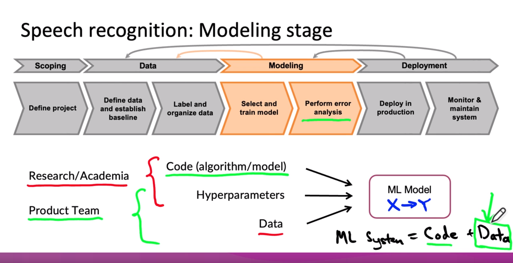

# Machine Learning in Production


[Curso](https://www.coursera.org/learn/introduction-to-machine-learning-in-production?specialization=machine-learning-engineering-for-production-mlops?utm_source=deeplearning-ai&utm_medium=institutions)

En este curso, aprenderás:

- Identifique los componentes clave del ciclo de vida del proyecto de ML, canalice y seleccione los mejores patrones de despliegue y supervisión para diferentes escenarios de producción.

- Optimice el rendimiento y las métricas del modelo dando prioridad a los ejemplos desproporcionadamente importantes que representan trozos clave de un conjunto de datos.

- Resuelva los retos de producción relacionados con los datos estructurados, no estructurados, pequeños y grandes, cómo la coherencia de las etiquetas es esencial y cómo puede mejorarla.


En este curso de Aprendizaje automático en producción, desarrollarás tu intuición sobre el diseño de un sistema de ML de producción 
de principio a fin: alcance del proyecto, necesidades de datos, estrategias de modelado y tecnologías y patrones de implementación. 

Aprenderá estrategias para abordar retos comunes en producción, como establecer una línea base del modelo, abordar la deriva 
del concepto y realizar análisis de errores. Seguirá un marco de trabajo para desarrollar, desplegar y mejorar continuamente una aplicación ML en producción. 
Comprender los conceptos de aprendizaje automático y aprendizaje profundo es esencial, pero si está buscando construir una carrera efectiva en IA, 
también necesita experiencia preparando sus proyectos para el despliegue. 

La ingeniería de aprendizaje automático para la producción combina los conceptos fundamentales del aprendizaje automático con las habilidades y 
las mejores prácticas del desarrollo de software moderno necesarias para implementar y mantener con éxito los sistemas de ML en entornos del mundo real. 

- Semana 1: Visión general del ciclo de vida y despliegue de ML 
- Semana 2: Selección y entrenamiento de un modelo 
- Semana 3: Definición de datos y línea de base


# INDEX 0
- [The Machine Learning Project Lifecycle](#the-machine-learning-project-lifecycle)
- [Deployment](#deployment)
- [Deploying a Deep Learning Model (Assessment 1)](#deploying-a-deep-learning-model-assessment-1)
- [Selecting and Training a Model](#selecting-and-training-a-model)
- [Error analysis and performance auditing](#error-analysis-and-performance-auditing)
- [Data iteration](#data-iteration)
- [Modeling challenges (Assessment 2)](#modeling-challenges-assessment-2)
- [Define Data and Establish Baseline](#define-data-and-establish-baseline)
- [Label and Organize Data](#label-and-organize-data)
- [Scoping](#scoping)
- [The Machine Learning Project Lifecycle (Assessment 3)](#the-machine-learning-project-lifecycle-assessment-3)

# The Machine Learning Project Lifecycle
[<- Return to INDEX 0](#index-0)

## INDEX 1
- [Welcome](#welcome)
- [Steps of an ML project](#steps-of-an-ml-project)
- [Case study: speech recognition](#case-study-speech-recognition)
- [Course outline](#course-outline)
- [Important: have questions, issues or ideas? Join our Forum](#important-have-questions-issues-or-ideas-join-our-forum)

## Welcome
[<- Return to INDEX 1](#index-1)

[<- Return to INDEX 1](#index-1)


Bienvenido al aprendizaje automático en producción. Muchos alumnos me han preguntado: Hola, Andrew, he aprendido a entrenar un modelo de aprendizaje automático, ahora, ¿qué hago? Los modelos de aprendizaje automático son geniales, pero a menos que sepas cómo ponerlos en producción, es difícil lograr que generen la máxima cantidad de valor posible. Este curso te enseñará cómo implementar y supervisar algoritmos de aprendizaje automático en producción.


### Ejemplo de implementación

1. **Visión Artificial para Inspección:** Utilizar visión artificial para inspeccionar teléfonos en busca de defectos como rasguños o grietas.
2. **Dispositivo Periférico:** Un dispositivo en la fábrica toma fotos y usa un software de inspección para decidir si el teléfono es aceptable.
3. **Servidor de Predicción:** El dispositivo periférico envía imágenes a un servidor de predicción, que puede estar en la nube o en el límite, para determinar si el teléfono es defectuoso.


### Desafíos de Producción

1. **Configuración de API:** Configurar interfaces API y escribir el software necesario para implementar el algoritmo en producción.
2. **Iluminación y Deriva de Datos:** Condiciones de iluminación cambiantes pueden afectar la precisión del modelo. Esto se denomina deriva conceptual o de datos.


Supongamos que escribes todo el software. Resulta que solo porque has entrenado un algoritmo de aprendizaje que funciona bien en tu conjunto de pruebas, todavía queda mucho trabajo y desafíos por delante para poner en marcha una implementación de producción valiosa. Este problema a veces se denomina deriva conceptual o deriva de datos.

> Nota:
> Algunos ingenieros de aprendizaje automático consideran que abordar problemas como la deriva de datos no es parte del trabajo de aprendizaje automático. Sin embargo, es crucial ajustar la distribución de datos en lugar de esperar que siempre sea ideal.

### Más Allá del Código de ML

1. **Brecha de Producción:** El éxito en una prueba de concepto no garantiza una implementación de producción sin problemas. Se necesita mucho más trabajo.
2. **Componentes Adicionales:** Más allá del código del modelo, se requieren componentes para la recopilación de datos, verificación, extracción de características, monitoreo, etc.


En este curso, aprenderás a planificar y ejecutar todo el ciclo de vida de un proyecto de aprendizaje automático, desde la definición del proyecto hasta la implementación y monitoreo del modelo en producción.


## Steps of an ML project
[<- Return to INDEX 1](#index-1)


Cuando estoy creando un sistema de aprendizaje automático, he descubierto que analizar detenidamente el ciclo de vida de un proyecto de Aprendizaje automático es una forma eficaz de planificar todos los pasos en los que tengo que trabajar. Este marco le permite planificar todas las cosas importantes que debe hacer para que el sistema funcione y también para minimizar las sorpresas.


### Ciclo de vida de un proyecto de ML

1. **Alcance:**
   - Definir el proyecto o decidir en qué trabajar.
   - Determinar qué es X y qué es Y.
2. **Datos:**
   - Definir y establecer una línea base de datos.
   - Etiquetar y organizar los datos.
   - Prácticas recomendadas para la recopilación de datos.
3. **Modelado:**
   - Seleccionar y entrenar el modelo.
   - Realizar un análisis de errores.
   - Actualizar el modelo basado en el análisis de errores.
4. **Despliegue:**
   - Implementar en producción.
   - Monitorear el sistema y rastrear los datos entrantes.
   - Mantener y actualizar el modelo según sea necesario.


### Implementación y Mantenimiento

- **Verificación Final:** Asegurarse de que el rendimiento del sistema es confiable para la aplicación antes de la implementación.
- **Mantenimiento:** Tras la implementación, el mantenimiento implica monitorear el sistema, realizar análisis de errores adicionales y reentrenar el modelo según sea necesario.
- **Lecciones Aprendidas:** La implementación inicial puede estar a mitad de camino, ya que las lecciones importantes a menudo se aprenden después de activar el tráfico en vivo.

En este vídeo, hemos revisado el ciclo de vida de un proyecto de aprendizaje automático. En el siguiente vídeo, veremos cómo estas etapas se aplican en el contexto de una aplicación de reconocimiento de voz.


## Case study: speech recognition
[<- Return to INDEX 1](#index-1)


Uno de los éxitos del aprendizaje profundo ha sido el reconocimiento de voz. El aprendizaje profundo ha hecho que el reconocimiento de voz sea mucho más preciso que hace una década. Esto nos permite utilizar el reconocimiento de voz en los altavoces inteligentes de nuestros teléfonos inteligentes para la búsqueda por voz y en otros contextos.

### Speech Recognition: Scoping Stage


1. **Definir el Proyecto:**
   - Decidir trabajar en reconocimiento de voz para búsqueda por voz.
   - Definir métricas clave: precisión, latencia, rendimiento.
   - Estimar recursos y cronograma.

### Speech Recognition: Data Stage


2. **Definir y Organizar Datos:**
   - Asegurar consistencia en el etiquetado de datos.
   - Decidir sobre la cantidad de silencio antes y después de cada clip.
   - Realizar la normalización del volumen.

> Nota:
> La consistencia en el etiquetado de datos es crucial para el rendimiento del algoritmo. Estándarizar las convenciones de etiquetado puede tener un impacto significativo.

### Speech Recognition: Modeling Stage



3. **Seleccionar y Entrenar el Modelo:**
   - Elegir la arquitectura del modelo y los hiperparámetros.
   - Realizar análisis de errores para mejorar datos y modelo.
   - Optimizar datos y hiperparámetros para obtener un modelo de alto rendimiento.

### Speech Recognition: Deployment Stage


4. **Implementar en Producción:**
   - Desplegar el modelo en producción.
   - Monitorear el sistema y mantenerlo actualizado.
   - Detectar y corregir la deriva de datos y conceptos.


> Ejemplo:
> Implementación de un sistema de reconocimiento de voz en un dispositivo móvil. Uso de VAD (Detección de Actividad de Voz) para seleccionar el audio relevante y enviarlo a un servidor de predicción en la nube. Monitoreo continuo para detectar problemas como la deriva de datos.

En este vídeo, hemos visto el ciclo de vida completo de un proyecto de aprendizaje automático utilizando el reconocimiento de voz como ejemplo. Desde el alcance hasta los datos, desde el modelado hasta la implementación. En el siguiente vídeo, veremos los principales conceptos y secuencias que aprenderá en este curso.


## Course outline
[<- Return to INDEX 1](#index-1)


Has visto el ciclo de vida del proyecto de aprendizaje automático. Repasemos brevemente lo que aprenderás en el resto de este curso. Aunque presenté el ciclo de vida de izquierda a derecha, descubrí que, para aprender estos materiales, sería más eficiente empezar por el objetivo final y empezar por la implementación y, luego, trabajar hacia atrás para modelar los datos y, luego, determinar el alcance.


### Temario del Curso

1. **Implementación:**
   - Ideas más importantes sobre la implementación.
2. **Modelado:**
   - Utilizar un enfoque centrado en los datos para mejorar el rendimiento del modelo.
3. **Datos:**
   - Definir y establecer una línea base de datos.
   - Etiquetar y organizar datos de manera sistemática.

> Nota:
> En la semana 3, también tenemos una sección opcional sobre el alcance, donde se compartirán consejos sobre cómo definir proyectos de aprendizaje automático efectivos.


### MLOps

- **MLOps (Operaciones de Aprendizaje Automático):**
  - Disciplina emergente que comprende un conjunto de herramientas y principios para respaldar el progreso a lo largo del ciclo de vida del proyecto de aprendizaje automático.
  - Ejemplo: Landing AI utiliza una herramienta de MLOps llamada LandingLens para acelerar estos pasos en aplicaciones de visión artificial.

En este curso, empezaremos por el objetivo final, comenzaremos por el despliegue y, a continuación, iremos avanzando hacia atrás. Implementar un sistema es una de las habilidades más importantes y valiosas en el aprendizaje automático actual. Pasemos al siguiente vídeo, en el que profundizaremos en las lecciones más importantes y las ideas más relevantes para implementar sistemas de aprendizaje automático. Nos vemos en el siguiente vídeo.

## Important: have questions, issues or ideas? Join our Forum
[<- Return to INDEX 1](#index-1)

¡Hola alumno!

¿Emocionado por este curso? Únase a nuestro Foro para:

- Chatear con otros: Compartir ideas, hacer preguntas y discutir sobre IA.

- Trabajar juntos: Colabore en proyectos de IA y construya algo impresionante.

- Manténgase al día: Reciba actualizaciones sobre cursos, eventos y noticias de IA.

Haga clic en 
https://bit.ly/3Hyd7DH
 para crear su cuenta gratuita y conectar con la comunidad global de IA

- El equipo de DeepLearning.IA

# Deployment
[<- Return to INDEX 0](#index-0)

## INDEX 2
- [Key challenges](#key-challenges)
- [Deployment patterns](#deployment-patterns)
- [Monitoring](#monitoring)
- [Pipeline monitoring](#pipeline-monitoring)
- [Week 1 optional References](#week-1-optional-references)
- [Lecture Notes Week 1](#lecture-notes-week-1)

## Key challenges
[<- Return to INDEX 2](#index-2)


Uno de los momentos más emocionantes de cualquier proyecto de aprendizaje automático es cuando puedes implementar tu modelo, pero ¿qué dificulta la implementación? Hay dos categorías principales de desafíos a la hora de implementar un modelo de aprendizaje automático: los problemas de aprendizaje automático o estadísticos, y los problemas de ingeniería de software. A continuación, veremos ambos para entender qué se debe hacer para asegurar el éxito en la implementación de tu sistema.

### Deriva de Concepto y de Datos

La deriva de concepto y de datos es un desafío común. Esto ocurre cuando los datos cambian después de que el sistema ya se ha implementado. Un ejemplo de deriva de datos es cuando las condiciones de iluminación cambian en una fábrica y el algoritmo ya no detecta arañazos en teléfonos inteligentes con la misma precisión. En el caso del reconocimiento de voz, los datos de usuario pueden cambiar con el tiempo debido a nuevas condiciones o cambios en el hardware.


**Ejemplo de reconocimiento de voz:**
- Conjunto de entrenamiento: Datos comprados o históricos de usuarios con transcripciones.
- Conjunto de prueba: Datos recientes para evaluar el sistema.

La deriva puede ser gradual, como el cambio en el lenguaje, o repentina, como los cambios en los patrones de uso de tarjetas de crédito durante la pandemia de COVID-19.

**Deriva de datos:** Cambios en la distribución de entrada (x).
**Deriva de concepto:** Cambios en el mapeo deseado de x a y.


### Problemas de Ingeniería de Software

Además de la gestión de cambios en los datos, otro conjunto de problemas se refiere a la ingeniería de software necesaria para implementar un sistema correctamente. 

**Lista de verificación de problemas de ingeniería de software:**
1. **Predicciones en tiempo real vs. por lotes:** Dependiendo de si se necesita una respuesta rápida (reconocimiento de voz) o análisis periódico (sistemas hospitalarios).
2. **Nube vs. Periferia/Navegador:** Decidir dónde ejecutar el servicio de predicción (en la nube, localmente, o en un navegador web).
3. **Recursos computacionales:** CPU/GPU y memoria disponibles.
4. **Latencia y rendimiento:** Medir en términos de QPS (consultas por segundo) y tiempo de respuesta.
5. **Registro de datos:** Importante para análisis futuros y reentrenamiento del algoritmo.
6. **Seguridad y privacidad:** Niveles de seguridad necesarios según la aplicación (p.ej., registros médicos).


### Primer Despliegue vs. Mantenimiento

El primer despliegue de un modelo de aprendizaje automático es solo el comienzo. Es necesario continuar monitoreando y manteniendo el sistema, adaptándose a los cambios en los datos y actualizando el modelo según sea necesario. La implementación inicial y el mantenimiento continuo requieren diferentes enfoques y prácticas.


En resumen, la implementación de un sistema incluye tareas tanto de aprendizaje automático como de ingeniería de software. En el siguiente vídeo, exploraremos patrones comunes de implementación para diferentes aplicaciones, ayudándote a elegir el más adecuado para tu proyecto.

## Deployment patterns
[<- Return to INDEX 2](#index-2)


Cuando has entrenado un algoritmo de aprendizaje, la mejor manera de implementarlo no suele ser simplemente activarlo y esperar lo mejor, porque, ¿qué pasa si algo sale mal? Al implementar sistemas, hay varios casos de uso comunes, así como diferentes patrones de implementación según el caso de uso. En este vídeo se desarrollan algunos de estos patrones con mayor detalle.


Un tipo de implementación es ofrecer un nuevo producto o capacidad que no existía antes. Por ejemplo, si ofreces un servicio de reconocimiento de voz que no ofrecías antes. En este caso, un patrón de diseño común es iniciar con una pequeña cantidad de tráfico y luego aumentarlo gradualmente.

Un segundo caso práctico de implementación es cuando hay algo que ya está haciendo una persona, pero ahora se usa un algoritmo de aprendizaje para automatizar o ayudar con esa tarea. Por ejemplo, si hay personas en una fábrica que inspeccionan los teléfonos inteligentes en busca de arañazos, pero ahora se desea usar un algoritmo de aprendizaje para ayudar o automatizar esa tarea.

Por último, un tercer caso de implementación común es si ya se ha estado realizando esta tarea con una implementación anterior de un sistema de aprendizaje automático, pero ahora se desea reemplazarlo por uno mejor. En estos casos, dos temas recurrentes son: un aumento gradual de la supervisión y la reversión en caso de fallos.


Un ejemplo de inspección visual puede ilustrar estos conceptos. En este caso, tal vez inspectores humanos inspeccionen los teléfonos inteligentes para detectar defectos o arañazos, y ahora se desea automatizar parte de este trabajo con un algoritmo de aprendizaje. Un patrón de implementación común es usar la implementación en modo sombra, donde un algoritmo de aprendizaje automático supervisa al inspector humano y se ejecuta en paralelo con él. Durante esta fase inicial, la salida del algoritmo de aprendizaje no se utiliza para ninguna decisión en la fábrica.


Cuando el algoritmo de aprendizaje está listo para tomar decisiones reales, un patrón de implementación común es utilizar un despliegue canario. En un despliegue canario, se utiliza una pequeña fracción del tráfico inicial (quizás un 5% o menos) para dejar que el algoritmo tome decisiones reales, monitoreando el sistema y aumentando el tráfico gradualmente.


Otro patrón de despliegue es un despliegue azul y verde. En este caso, se tiene un sistema de cámaras que recopila imágenes del teléfono en una fábrica. Estas imágenes se envían a un software de inspección visual. La versión anterior del software se denomina versión azul y la nueva versión se denomina versión verde. En una implementación azul y verde, el router envía imágenes a la versión anterior y, cuando se quiere cambiar a la nueva versión, el router deja de enviar imágenes a la versión anterior y cambia a la nueva versión.

> Nota:
> La ventaja de una implementación azul y verde es que permite una fácil reversión si algo sale mal.


Al implementar un sistema, es útil pensar en el despliegue como un espectro de grados de automatización. Un extremo sería un sistema solo para humanos, mientras que el otro extremo sería una automatización total. Entre estos extremos, hay grados intermedios como la asistencia de la IA y la automatización parcial, donde el algoritmo de aprendizaje toma decisiones cuando está seguro y las delega a un humano cuando no lo está.


> Nota:
> La automatización parcial es un punto de diseño muy útil para aplicaciones donde el rendimiento del algoritmo de aprendizaje no es lo suficientemente bueno para una automatización total.

En resumen, hay varios patrones de despliegue como el modo sombra, el despliegue canario y el despliegue azul y verde. También se puede elegir el grado de automatización más adecuado según la aplicación, que puede ser desde la asistencia de IA hasta la automatización completa. Es importante la supervisión para detectar y abordar cualquier problema.

## Monitoring
[<- Return to INDEX 2](#index-2)


¿Cómo puede supervisar un sistema de aprendizaje automático para asegurarse de que cumple sus expectativas de rendimiento? En este vídeo, conocerá las prácticas recomendadas para supervisar los sistemas de aprendizaje automático implementados. La forma más común de supervisar un sistema de aprendizaje automático es utilizar un panel para hacer un seguimiento de su rendimiento a lo largo del tiempo. En función de la aplicación, los paneles de control pueden supervisar diferentes métricas. Por ejemplo, puede tener un panel para monitorear la carga del servidor o un panel diferente para monitorear la difracción de las salidas no nulas. Por lo tanto, a veces el sistema de reconocimiento de voz emite un valor nulo y cree que el usuario no ha dicho nada. Por lo tanto, si esto cambia drásticamente con el tiempo, puede ser una indicación de que algo anda mal. 


O una característica común que he visto en muchas tareas de datos estructurados es la supervisión de la fracción de valores de entrada que faltan. Si eso cambia, puede significar que algo ha cambiado en sus datos. Por eso, cuando intentes decidir qué monitorear, te recomiendo que te sientes con tu equipo e intercambies ideas sobre todas las cosas que podrían salir mal y sobre las que quieres saber. Si algo sale mal, y a pesar de todas las cosas que podrían salir mal, haz una lluvia de ideas sobre algunas estadísticas o métricas que detecten ese problema. 

> Nota:
> Brainstorm the things that could go wrong. Brainstorm a few statistics/metrics that will detect the problem. It is ok to use many metrics initially and gradually remove the ones you find not useful.


Estos son algunos ejemplos de métricas que he usado o he visto a otros usar en una variedad de proyectos. En primer lugar, están las métricas del software, como la memoria, el procesamiento, la latencia, el rendimiento y la carga del servidor. Cosas que le ayudan a supervisar el estado de la implementación de su software, del servicio de predicción o de otras piezas de software relacionadas con su algoritmo de aprendizaje. 


Sin embargo, estas métricas de software le ayudarán a asegurarse de que su software funciona correctamente. Muchas herramientas de MLOps ya estarán listas para usar para rastrear estas métricas de software. Además de las métricas del software, a menudo elijo otras métricas que ayudan a monitorear el estado estadístico o el rendimiento del algoritmo de aprendizaje. En términos generales, hay dos tipos de métricas sobre las que podrías hacer una lluvia de ideas. Una son las métricas de entrada, que son métricas que miden: ¿ha cambiado su distribución de entrada x? 


Por ejemplo, si está creando un sistema de reconocimiento de voz, puede supervisar la longitud media de entrada en segundos de la duración del clip de audio que se envía a su sistema. Puede monitorear el volumen de entrada promedio y, si estos cambian por alguna razón, es posible que desee analizar eso solo para asegurarse de que esto no haya afectado el rendimiento de su algoritmo. Como acabo de mencionar, el número o el porcentaje de valores faltantes es una métrica muy común cuando se utilizan datos estructurados, algunos de los cuales pueden tener valores faltantes. O, para el ejemplo de la inspección visual de fabricación, puede supervisar el brillo medio de la imagen si cree que las condiciones de iluminación pueden cambiar y quiere asegurarse de que lo hace. De este modo, puedes hacer una lluvia de ideas sobre diferentes métricas para ver si tu distribución de entrada x podría haber cambiado. 


Un segundo conjunto de métricas que ayudan a comprender si el algoritmo de aprendizaje está funcionando bien son las métricas de salida. Por ejemplo, ¿con qué frecuencia el sistema de reconocimiento de voz devuelve null, la cadena vacía, porque cree que el usuario no ha dicho nada? O si ha creado un sistema de reconocimiento de voz para búsquedas web mediante voz. Puede decidir ver con qué frecuencia un usuario realiza dos búsquedas muy rápidas seguidas con prácticamente la misma entrada. Eso podría ser una señal de que reconociste mal su consulta la primera vez. Es una señal imperfecta, pero puedes probar esta métrica y ver si te ayuda. También puede controlar el número de veces que un usuario ha intentado utilizar el sistema de voz por primera vez y, a continuación, pasa a escribir. Esto podría ser una señal de que el usuario se ha sentido frustrado o ha abandonado tu sistema de voz y podría indicar un rendimiento degradante. 


Y, por supuesto, para la búsqueda web también utilizarías métricas muy burdas, como la tasa de clics o el CTR, solo para asegurarte de que el sistema en general funciona correctamente. Por lo tanto, estas métricas de salida pueden ayudarlo a determinar si la salida y de su algoritmo de aprendizaje ha cambiado de alguna manera. O si algo que se produce incluso después de la salida del algoritmo de aprendizaje, como un usuario que pasa a escribir, ha cambiado de manera significativa. Como las métricas de entrada y salida son específicas de la aplicación, la mayoría de las herramientas de mLOps deberán configurarse específicamente para realizar un seguimiento de las métricas de entrada y salida de su aplicación. Es posible que ya sepa que el modelado con aprendizaje automático es un proceso altamente iterativo, al igual que la implementación. Toma el modelaje. Crearías un modelo de aprendizaje automático y algunos datos, entrenarías un modelo que fuera un experimento. Y, a continuación, realice un análisis de errores y utilice el análisis de errores para volver a averiguar cómo mejorar el modelo o sus datos. Y es al recorrer este ciclo varias veces como, con suerte, se llega a un buen modelo.

## Pipeline monitoring
[<- Return to INDEX 2](#index-2)


Muchos sistemas de IA no se limitan a un modelo de aprendizaje automático que ejecuta un servicio de predicción, sino que implican un proceso de varios pasos. Este proceso se conoce como *pipeline* de aprendizaje automático.


El profesor usa un ejemplo de reconocimiento de voz para ilustrar este concepto. En aplicaciones móviles, el reconocimiento de voz no es un proceso simple de audio a transcripción. En cambio, se utiliza un módulo de detección de actividad de voz (VAD) para determinar si alguien está hablando. Solo si el VAD detecta voz, el audio se envía al sistema de reconocimiento de voz en la nube. Esto ahorra ancho de banda y recursos.

Este proceso de dos pasos, donde un algoritmo detecta voz y otro la transcribe, es un ejemplo de un *pipeline* de aprendizaje automático. Los cambios en un paso pueden afectar el rendimiento del siguiente. Por ejemplo, un nuevo modelo de teléfono puede tener un micrófono que funcione de manera diferente, lo que lleva al VAD a recortar el audio de manera diferente. Este cambio en la salida del VAD afecta la entrada del sistema de reconocimiento de voz, lo que puede degradar su rendimiento.


El profesor presenta otro ejemplo con perfiles de usuario. Los datos del flujo de clics se utilizan para crear un perfil de usuario, que intenta predecir atributos clave del usuario, como si posee un automóvil. Este perfil se utiliza luego en un sistema de recomendación para generar recomendaciones de productos. Si la distribución de los datos del flujo de clics cambia, el sistema de perfiles de usuario puede tener dificultades para predecir si un usuario posee un automóvil, lo que aumenta el porcentaje de etiquetas "desconocidas". Este cambio en la salida del sistema de perfiles afecta la entrada del sistema de recomendación, lo que puede afectar la calidad de las recomendaciones.

> Nota:
> Este ejemplo ilustra cómo los cambios en un paso del pipeline pueden propagarse a través del sistema, afectando el rendimiento general. Es fundamental monitorear las métricas a lo largo del pipeline para detectar y abordar estos problemas.


El profesor recomienda hacer una lluvia de ideas sobre las métricas para monitorear que puedan detectar cambios en el pipeline. Estas métricas deben incluir:

- Métricas de software para cada componente y para el pipeline en su conjunto.
- Métricas de entrada y salida para cada componente.

Monitorear estas métricas puede ayudar a detectar problemas como cambios en el recorte de audio del VAD o un aumento en los atributos desconocidos en el sistema de perfiles de usuario.


Por último, el profesor analiza la velocidad a la que cambian los datos. Esto varía mucho según el problema. Algunos datos, como la apariencia de las personas, cambian lentamente, mientras que otros, como los datos de una fábrica, pueden cambiar rápidamente. En general, los datos de los usuarios cambian lentamente, mientras que los datos empresariales pueden cambiar rápidamente.

> Nota:
> Comprender la velocidad a la que cambian los datos puede ayudar a determinar la frecuencia con la que se deben volver a entrenar los modelos de aprendizaje automático y la frecuencia con la que se deben monitorear las métricas.

## Week 1 optional References
[<- Return to INDEX 2](#index-2)

**Semana 1: Visión general del ciclo de vida del ML e implantación**

Si desea profundizar en los temas tratados esta semana, no dude en consultar estas referencias opcionales. No tendrá que leerlas para completar los cuestionarios prácticos de esta semana.

[Concepto y deriva de datos](https://towardsdatascience.com/machine-learning-in-production-why-you-should-care-about-data-and-concept-drift-d96d0bc907fb)

[Supervisión de modelos ML](https://christophergs.com/machine%20learning/2020/03/14/how-to-monitor-machine-learning-models/)

[Una charla con Andrew sobre MLOps: de centrarse en los modelos a centrarse en los datos
](https://youtu.be/06-AZXmwHjo)


### Ponencias

- Konstantinos, Katsiapis, Karmarkar, A., Altay, A., Zaks, A., Polyzotis, N., ... Li, Z. (2020). Hacia la ingeniería del ML: Una breve historia de TensorFlow Extended (TFX). 
http://arxiv.org/abs/2010.02013

- Paleyes, A., Urma, R.-G., & Lawrence, N. D. (2020). Desafíos en el despliegue del aprendizaje automático: Una encuesta de casos prácticos. 
http://arxiv.org/abs/2011.09926

- Sculley, D., Holt, G., Golovin, D., Davydov, E., & Phillips, T. (s.f.). Deuda técnica oculta en los sistemas de aprendizaje automático. Obtenido el 28 de abril de 2021, de Nips.c
https://papers.nips.cc/paper/2015/file/86df7dcfd896fcaf2674f757a2463eba-Paper.pdf

  
### Resumen del artículo sobre el drift de datos y concepto en Machine Learning

El artículo de Towards Data Science aborda la importancia de monitorear y manejar el drift de datos y concepto en modelos de machine learning en producción. Aquí tienes un resumen de los puntos clave:

1. Definiciones Clave:

   - **Data Drift:** Se refiere a cambios en la distribución de los datos de entrada con el tiempo. Esto puede ocurrir debido a cambios en el entorno o en los datos recolectados, afectando el rendimiento del modelo ya que los datos nuevos difieren de los datos con los que el modelo fue entrenado.
   - **Concept Drift:** Implica un cambio en las relaciones subyacentes entre las características de entrada y las variables objetivo. Esto significa que las asociaciones que el modelo aprendió ya no se aplican, a menudo debido a cambios en el contexto o en el comportamiento del mundo real.

2. Impacto en Modelos de Producción:
   
   - El rendimiento de los modelos de machine learning puede degradarse con el tiempo debido a estos drifts. Es crucial detectar y mitigar estos cambios para mantener la precisión y la relevancia del modelo.
   - Data Drift tiende a ser un proceso gradual, mientras que Concept Drift puede ser gradual, súbito o recurrente.

3. Estrategias de Monitoreo y Mitigación:

   - **Monitoreo Continuo:** Es esencial implementar sistemas de monitoreo que detecten cambios en las distribuciones de datos y en las relaciones entre las variables. Herramientas como EvidentlyAI pueden ser útiles para estos propósitos.
   - **Retrain y Calibración:** Dependiendo de la severidad del drift, se pueden tomar acciones como recalibrar el modelo, reentrenarlo con nuevos datos, o incluso reconstruirlo con nuevas arquitecturas o características adaptadas a los nuevos patrones de datos.
   - **Comunicación y Adaptación del Negocio:** Alinearse con los propietarios del negocio y los mantenedores del modelo para prepararse ante nuevos cambios y adaptar el modelo a nuevas condiciones es fundamental.

4. Casos Prácticos y Herramientas:

   - La implementación de técnicas como el método de Page-Hinkley para la detección de drift en la media de los datos y el uso de reportes detallados de drift para análisis son estrategias recomendadas.
   - Es importante distinguir entre problemas de calidad de datos y drift, ya que los primeros se refieren a datos corruptos o incompletos, mientras que el drift se refiere a cambios estadísticos en distribuciones de datos válidos.

Para más detalles, puedes revisar el artículo completo en EvidentlyAI.

Fuentes:

- EvidentlyAI (www.evidentlyai.com)
- DataCamp (www.datacamp.com)

### How to Monitor Machine Learning Models


El artículo "How to Monitor Machine Learning Models" de ChristopherGS describe cómo gestionar y supervisar modelos de machine learning en producción. Aquí tienes un resumen más detallado:

#### Importancia del Monitoreo
Monitorear modelos de ML es crucial para mantener su rendimiento y detectar problemas antes de que afecten a los usuarios o al negocio. Los modelos en producción pueden degradarse debido a cambios en los datos, problemas de infraestructura o errores no anticipados durante el desarrollo.

#### Principales Desafíos

1. **Cambios en los Datos:** A medida que los datos evolucionan, las distribuciones pueden cambiar, causando que el modelo se vuelva menos preciso (data drift).
2. **Concept Drift:** Cambios en las relaciones subyacentes entre las variables independientes y dependientes que afectan la eficacia del modelo.
3. **Errores Técnicos:** Fallos en la infraestructura, errores en los pipelines de datos, y problemas de escalabilidad pueden afectar el rendimiento del modelo.

#### Estrategias de Monitoreo

1. **Métricas de Rendimiento del Modelo:** Supervisar métricas como la precisión, recall, F1-score, AUC-ROC, etc., para asegurarse de que el modelo sigue funcionando correctamente.
2. **Monitoreo de Datos:** Evaluar continuamente la calidad y las características de los datos de entrada y salida para detectar anomalías.
3. **Logs y Trazas**: Mantener registros detallados de las predicciones del modelo, errores y tiempos de respuesta para facilitar la detección y resolución de problemas.
4. **Alertas y Notificaciones:** Configurar sistemas de alerta que notifiquen a los equipos de desarrollo y operaciones sobre cualquier problema potencialmente crítico.

#### Herramientas y Tecnologías

1. **Prometheus y Grafana:** Para la recolección y visualización de métricas.
2. **Kubernetes:** Para la gestión de la infraestructura subyacente que soporta los modelos de ML.
3. **TensorFlow Extended (TFX):** Para la automatización de los pipelines de machine learning.
4. **Seldon:** Para el despliegue y monitoreo de modelos en Kubernetes.

#### Prácticas Recomendadas

1. **Observabilidad Completa:** Implementar un sistema de monitoreo robusto que incluya métricas de negocio y de rendimiento del modelo.
2. **Automatización de Pipelines:** Automatizar el proceso de reentrenamiento y despliegue de modelos para adaptarse rápidamente a los cambios en los datos.
3. **Colaboración Entre Equipos:** Fomentar la colaboración entre científicos de datos y equipos de operaciones para asegurar un monitoreo eficiente y resolución de problemas.


En resumen, la supervisión eficaz de los modelos de ML en producción requiere una combinación de métricas de rendimiento, monitoreo de datos, logs detallados, y sistemas de alerta. Utilizar herramientas como Prometheus, Grafana, y TFX puede ayudar a gestionar estos desafíos de manera más efectiva.

Para más detalles, puedes leer el artículo completo en ChristopherGS.

## Lecture Notes Week 1
[<- Return to INDEX 2](#index-2)

Las notas de esta sección están disponibles en:

[C1_W1.pdf](notes/C1_W1.pdf)


# Deploying a Deep Learning Model (Assessment 1)
[<- Return to INDEX 0](#index-0)

## INDEX 3
- [The Machine Learning Project Lifecycle](#the-machine-learning-project-lifecycle)
- [Deployment](#deployment)
- [Deploying a Deep Learning Model](#deploying-a-deep-learning-model)
- [Deploying a deep learning model with Docker and a cloud service](#deploying-a-deep-learning-model-with-docker-and-a-cloud-service)

## The Machine Learning Project Lifecycle
[<- Return to INDEX 3](#index-3)

1. **Question 1**

   Which of these are stages of the machine learning project lifecycle? Check all that apply.

   - [x] Deployment
     > **Correct!** Deployment is the fourth stage of the machine learning project lifecycle.
   - [ ] Configuration
   - [x] Modeling
     > **Correct!** You're right! Modeling is the third stage of the machine learning project lifecycle.
   - [x] Data
     > **Correct!** Right on! Data is the second stage of the machine learning project lifecycle.
   - [x] Scoping
     > **Correct!** That's right! Scoping is the first stage of the machine learning project lifecycle.

2. **Question 2**

   Which of these is not an advantage of a typical edge deployment compared to a typical cloud deployment?

   - [ ] Lower latency
   - [x] More computational power available
   - [ ] Less network bandwidth needed
   - [ ] Can function even if network connection is down

   > **Correct!** Edge deployments are frequently constrained in computational power due to cost, size, and energy requirements of the hardware.

3. **Question 3**

   In the speech recognition example, what is the problem with some labelers transcribing audio as “Um, today’s weather” and others transcribing “Umm... today’s weather”?

   - [x] Either transcription is okay, but the inconsistency is problematic.
   - [ ] The second is grammatically incorrect and we should use the first transcription.
   - [ ] The first is grammatically incorrect and we should use the second transcription.
   - [ ] We should not be transcribing “Umm.” The correct transcription, which serves the user's needs better, is just “Today’s weather.

   > **Correct!** The labelling instructions should remove ambiguity such that every example is labelled consistently.

4. **Question 4**

   After a system is deployed, monitoring and maintaining the system will help us handle cases of concept drift or data drift.

   - [x] True
   - [ ] False

   > **Correct!** The last step of the machine learning project lifecycle is monitoring and maintenance, which is necessary because your project's use cases and data may change over time!

5. **Question 5**

   Which statement is a more accurate description of the full cycle of a machine learning project?

   - [ ] It is a linear process, in which we move step-by-step from scoping to deployment. (That’s why we call it a cycle. Bicycles are only good at going forward, not backward.)
   - [x] It is an iterative process, where during a later stage we might go back to an earlier stage. (That’s why we call it a cycle--it’s a circular process.)

   > **Correct!** That's right!
   
## Deployment
[<- Return to INDEX 3](#index-3)

1. **Question 1**
   You’ve built a new system for making loan approval decisions. For now, its output is not used in any decision making process, and a human loan officer is solely responsible for deciding what loans to approve. But the system’s output is logged for analysis. What is this type of deployment called?

   - [x] Shadow mode deployment
   - [ ] Blue green deployment
   - [ ] Canary deployment
   - [ ] Red green deployment

   > **Correct!** That's right! Shadow mode is a type of deployment where the ML algorithm runs in parallel with the user but it’s output isn’t used for any decision making.

2. **Question 2**
   On a social media platform, you’re rolling out a new anti-spam system to flag and hide spammy posts. Your team decides to roll out the anti-spam filter via a canary deployment, and roll it out to 1% of users initially. Which of these would you advocate for?

   - [ ] After a successful canary deployment, begin to implement a shadow mode deployment.
   - [ ] Monitor that 1% of users’ reaction, and if it goes well, flip the switch to send all traffic (100%) to the system.
   - [ ] Avoid intervening with a rollback until ramp up is complete even if the system isn't working.
   - [x] Monitor that 1% of users’ reaction, and either gradually ramp up (if it’s going well) or rollback (if not)

   > **Correct!** That's right! A canary deployment allows you to monitor the performance of an algorithm on a subset of all traffic and then either ramp up to more traffic or rollback if an issue is detected.

3. **Question 3**
   You’re building a healthcare screening system, where you input a patient’s symptoms, and for the easy cases (such as an obvious case of the common cold) the system will give a recommendation directly, and for the harder cases it will pass the case on to a team of in-house doctors who will form their own diagnosis independently. What degree of automation are you implementing in this example for patient care? 

   - [x] Human only  
   - [ ] Shadow mode 
   - [ ] Full Automation
   - [x] Partial Automation

   > **Correct!** That’s correct! This type of approach offers some automation, but still requires a human in the loop.

4. **Question 4**
   You have built and deployed an anti-spam system that inputs an email and outputs either 0 or 1 based on whether the email is spam. Which of these will result in either concept drift or data drift?

   - [x] Spammers trying to change the wording used in emails to get around your spam filter.
   - [ ] Cloud computational costs going down, resulting in a lower cost to process each email received.
   - [ ] Updating a monitoring dashboard to keep track of new metrics.
   - [ ] None of these will result in either concept drift or data drift.

   > **Correct!** That's right! Changing the wording will result in a concept or data drift. 

5. **Question 5**
   Which of these statements is a more accurate description of deployment?

   - [x] It is an iterative process, where you should expect to make multiple adjustments (such as metrics monitored using dashboards or percentage of traffic served) to work towards optimizing the system.
   - [ ] Because deployment is a high stakes event, it's critical to design the right system, so that immediately after launch it will immediately work reliably and scale effectively.

   > **Correct!** That's correct! Don't plan or expect to perfect the deployment on your first attempt, it's much more reasonable and efficient to iterate on the process and optimize its performance over time.


## Deploying a Deep Learning Model
[<- Return to INDEX 3](#index-3)


## Laboratorio Sin Graduar Parte 1 - Desplegando un Modelo de Aprendizaje Automático

> Nota: la versión notebook está en: [server-coursera.ipynb](notebooks/W1/1-server-coursera/server-coursera.ipynb)

Bienvenido a este laboratorio sin graduar. Este laboratorio trata sobre desplegar un modelo de visión por computadora entrenado para detectar objetos comunes en imágenes.

Generalmente, desplegar el modelo es uno de los últimos pasos, pero aquí lo haremos primero. Utilizaremos un modelo de detección de objetos preentrenado llamado YOLOV3.


En este laboratorio, harás:

1. Inspeccionar el conjunto de datos de imágenes utilizado para la detección de objetos

2. Examinar el modelo en sí

3. Desplegar el modelo usando FastAPI


### ¿Por qué desplegar?

Desplegar tu modelo transforma tu prototipo en una herramienta práctica que puede ser integrada en aplicaciones, sitios web, y otros sistemas.


### ¿Por qué FastAPI?

FastAPI te permite crear servidores web para alojar tus modelos sin necesidad de construir una aplicación web completa. FastAPI es rápido y tiene un cliente integrado que se puede usar para interactuar con el servidor.


### Detección de Objetos con YOLOV3


#### Inspeccionando las Imágenes

En esta sección, usarás `YOLOV3` para una tarea de detección de objetos. Veamos las imágenes que pasarán al modelo YOLOV3.


```python

from IPython.display import Image, display


# Algunas imágenes de ejemplo

image_files = ['apple.jpg', 'clock.jpg', 'oranges.jpg', 'car.jpg']

for image_file in image_files:

    print(f"\nMostrando imagen: {image_file}")

    display(Image(filename=f"images/{image_file}"))

```

Mostrando imagen: apple.jpg 


Mostrando imagen: clock.jpg 


Mostrando imagen: oranges.jpg 


Mostrando imagen: car.jpg 


#### Visión General del Modelo

Luego, comprobarás qué tan bien el modelo puede detectar y clasificar objetos.


```python

import cv2  # suprimir advertencias de Tensorflow

os.environ['TF_CPP_MIN_LOG_LEVEL'] = '3'

import cvlib as cv

from cvlib.object_detection import draw_bbox


def detect_and_draw_box(filename, model="yolov3-tiny", confidence=0.5):

    """Detecta objetos comunes en una imagen y crea una nueva imagen con cuadros delimitadores.

    Args:

        filename (str): Nombre del archivo de la imagen.

        model (str): Puede ser "yolov3" o "yolov3-tiny". Por defecto es "yolov3-tiny".

        confidence (float, opcional): Nivel de confianza deseado. Por defecto 0.5.

    """

    img_filepath = f'images/{filename}'

    img = cv2.imread(img_filepath)

    bbox, label, conf = cv.detect_common_objects(img, confidence=confidence, model=model)

    print(f"========================\nImagen procesada: {filename}\n")

    for l, c in zip(label, conf):

        print(f"Objeto detectado: {l} con nivel de confianza de {c}\n")

    output_image = draw_bbox(img, bbox, label, conf)

    cv2.imwrite(f'images_with_boxes/{filename}', output_image)

    display(Image(f'images_with_boxes/{filename}'))


for image_file in image_files:

    detect_and_draw_box(image_file)

```

========================

Imagen procesada: apple.jpg

Objeto detectado: apple con nivel de confianza de 0.57171


...


#### Cambiando el Nivel de Confianza


Probemos con una imagen más difícil que contiene varios objetos:

```python

detect_and_draw_box("fruits.jpg")

```


... El modelo no detectó varias frutas y clasificó incorrectamente una naranja como una manzana. Probemos bajando el nivel de confianza:

```python

detect_and_draw_box("fruits.jpg", confidence=0.2)

```


... Bajando el nivel de confianza, el modelo detectó más frutas, pero algunas están mal clasificadas.


#### Desplegando el Modelo usando FastAPI


```python

import io

import uvicorn

import numpy as np

import nest_asyncio

from enum import Enum

from fastapi import FastAPI, UploadFile, File, HTTPException

from fastapi.responses import StreamingResponse


# Crear una instancia de FastAPI

app = FastAPI(title='Desplegando un Modelo de AA con FastAPI')


# Enumerar los modelos disponibles

class Model(str, Enum):

    yolov3tiny = "yolov3-tiny"

    yolov3 = "yolov3"


# Punto de entrada para la página de inicio

@app.get("/")

def home():

    return "¡Felicitaciones! Tu API está funcionando como se esperaba. Ahora dirígete a http://serve/docs"


# Punto de entrada para las predicciones

@app.post("/predict")

def prediction(model: Model, file: UploadFile = File(...)):

    # 1. VALIDAR EL ARCHIVO DE ENTRADA

    filename = file.filename

    fileExtension = filename.split(".")[-1] in ("jpg", "jpeg", "png")

    if not fileExtension:

        raise HTTPException(status_code=415, detail="Archivo no soportado.")

    # 2. TRANSFORMAR LA IMAGEN CRUDA EN CV2

    image_stream = io.BytesIO(file.file.read())

    image_stream.seek(0)

    file_bytes = np.asarray(bytearray(image_stream.read()), dtype=np.uint8)

    image = cv2.imdecode(file_bytes, cv2.IMREAD_COLOR)

    # 3. EJECUTAR EL MODELO DE DETECCIÓN DE OBJETOS

    bbox, label, conf = cv.detect_common_objects(image, model=model)

    output_image = draw_bbox(image, bbox, label, conf)

    cv2.imwrite(f'images_uploaded/{filename}', output_image)

    # 4. HACER STREAM DE LA RESPUESTA DE VUELTA AL CLIENTE

    file_image = open(f'images_uploaded/{filename}', mode="rb")

    return StreamingResponse(file_image, media_type="image/jpeg")


# Ejecutar el servidor

nest_asyncio.apply()

uvicorn.run(app, host="127.0.0.1", port=8000, root_path="/serve")

```

INFORMACIÓN: Servidor iniciado en http://127.0.0.1:8000 (Presiona CTRL+C para salir)

### Usando el Cliente Integrado de FastAPI

Para utilizar tu servidor de detección de imágenes, puedes aprovechar el cliente que viene integrado con FastAPI. Aquí están los pasos que debes seguir para interactuar con él. Lee toda la lista antes de intentarlo:


1. Escribe `/serve/docs` en la barra de navegación y presiona `Enter`.


2. Haz clic en cualquier parte del punto de entrada `/predict` y se harán visibles más opciones:


3. Haz clic en el botón **Try it out** para probar tu servidor


4. Elige un modelo del campo **model** (si seleccionas el modelo completo YOLOV3, el servidor quedará atascado hasta que se descarguen los pesos de este modelo).


5. Haz clic en el botón **Choose File** para **enviar una imagen** desde tu sistema de archivos local.


6. Haz clic en el botón azul **Execute** para enviar una solicitud HTTP al servidor.


7. **Desplázate hacia abajo para ver la respuesta del servidor**. ¡Genial, verdad?


8. **¡Prueba con diferentes imágenes!** Puedes usar las proporcionadas en este laboratorio o algunas tuyas. Dado que el modelo está utilizando un nivel de confianza predeterminado de 0.5, puede que no siempre detecte algunos objetos. También puedes intentar enviar archivos que no sean imágenes para ver cómo reacciona el servidor.


### (Opcional) Consumir tu Modelo desde otro Cliente

Es grandioso que FastAPI te permita interactuar con tu API a través de su cliente integrado. Sin embargo, podrías preguntarte cómo interactuar con tu API utilizando código regular y no una interfaz de usuario. Hay una sección extra que muestra cómo codificar un cliente mínimo en Python. Esto es útil para desglosar (en un nivel muy alto) lo que está haciendo el cliente de FastAPI internamente.


Puedes encontrar un notebook llamado `client-coursera.ipynb` en el explorador de archivos a la izquierda. Haz doble clic en él para abrirlo en una nueva pestaña, luego sigue las instrucciones. Asegúrate de que tu servidor (`uvicorn.run(app, host=host, port=8000, root_path="/serve")`) siga ejecutándose antes de cambiar a ese notebook.


¡Y eso es todo! Ahora has desplegado un modelo de detección de objetos en FastAPI y has aprendido a interactuar con él utilizando el cliente integrado. ¡Sigue explorando y divirtiéndote con tu poderoso nuevo servidor!

### Consumir tu Servicio

Visita `http://127.0.0.1:8000/` y `http://127.0.0.1:8000/docs` para probarlo.

## Laboratorio Sin Graduar Parte 2 - Consumiendo un Modelo de Aprendizaje Automático

> Nota: la versión notebook está en: [client-coursera.ipynb](notebooks/W1/2-client-coursera/client-coursera.ipynb)

¡Bienvenido a la segunda parte de este laboratorio sin graduar!

**Antes de avanzar, verifica que el servidor de la parte 1 aún esté corriendo.**

En este notebook, codificarás un cliente mínimo que utiliza la biblioteca `requests` de Python para interactuar con tu servidor en funcionamiento.


```python

import os

import io

import cv2

import requests

import numpy as np

from IPython.display import Image, display

```


### Entendiendo la URL

#### Desglosando la URL

Después de experimentar con el cliente de FastAPI, habrás notado que realizaste todas las solicitudes apuntando a una URL específica y agregando algunos parámetros a ella. Más concretamente:

1. El servidor está alojado en la URL `http://localhost:8000/` o el alias `/serve`.

2. El endpoint que sirve tu modelo es el endpoint `/predict`. También puedes especificar el modelo a usar: `yolov3` o`yolov3-tiny`. Nos quedaremos con la versión tiny por eficiencia computacional.


Empecemos poniendo toda esta información en su lugar.


```python

base_url = 'http://localhost:8000'

endpoint = '/predict'

model = 'yolov3-tiny'

```

Para consumir tu modelo, agregas el endpoint a la URL base para obtener la URL completa. Observa que los parámetros no están presentes por ahora.


```python

url_with_endpoint_no_params = base_url + endpoint

url_with_endpoint_no_params

```


'http://localhost:8000/predict'


Para establecer cualquiera de los parámetros esperados, la sintaxis es agregar un carácter "?" seguido del nombre del parámetro y su valor. Hagámoslo y verifiquemos cómo se ve la URL final:


```python

full_url = url_with_endpoint_no_params + "?model=" + model

full_url

```


'http://localhost:8000/predict?model=yolov3-tiny'


Este endpoint espera tanto el nombre de un modelo como una imagen. Pero dado que la imagen es más compleja, no se pasa dentro de la URL. En su lugar, aprovechamos la biblioteca `requests` para manejar este proceso.


### Enviando una Solicitud a tu Servidor

#### Codificando la función response_from_server


Como recordatorio, este endpoint espera una solicitud HTTP POST. La función `post` es parte de la biblioteca requests. Para pasar el archivo junto con la solicitud, necesitas crear un diccionario indicando el nombre del archivo ('file' en este caso) y el archivo real. `status code` es un comando útil para verificar el estado de la respuesta que activó la solicitud. **Un código de estado de 200 significa que todo salió bien.**


```python

def response_from_server(url, image_file, verbose=True):

    """Realiza una solicitud POST al servidor y devuelve la respuesta.

    Args:

        url (str): URL a la que se envía la solicitud.

        image_file (_io.BufferedReader): Archivo para cargar, debe ser una imagen.

        verbose (bool): True si debe imprimirse el estado de la respuesta. False en caso contrario.

    Returns:

        requests.models.Response: Respuesta del servidor.

    """

    files = {'file': image_file}

    response = requests.post(url, files=files)

    status_code = response.status_code

    if verbose:

        msg = "¡Todo salió bien!" if status_code == 200 else "Hubo un error al manejar la solicitud."

        print(msg)

    return response

```


Para probar esta función, abre un archivo en tu sistema de archivos y pásalo como parámetro junto con la URL:


```python

with open("images/clock2.jpg", "rb") as image_file:

    prediction = response_from_server(full_url, image_file)

```


¡Todo salió bien!

¡Buenas noticias! La solicitud fue exitosa. Sin embargo, no estás obteniendo ninguna información sobre los objetos en la imagen.


Para obtener la imagen con los cuadros delimitadores y etiquetas, necesitas parsear el contenido de la respuesta en un formato adecuado. Este proceso se parece mucho a cómo lees imágenes crudas en una imagen cv2 en el servidor.


Para manejar este paso, vamos a crear un directorio llamado `images_predicted` para guardar la imagen:


```python

dir_name = "images_predicted"

if not os.path.exists(dir_name):

    os.mkdir(dir_name)

```


#### Creando la función display_image_from_response


```python

def display_image_from_response(response):

    """Mostrar la imagen dentro de la respuesta del servidor.

    Args:

        response (requests.models.Response): La respuesta del servidor después de la detección de objetos.

    """

    image_stream = io.BytesIO(response.content)

    image_stream.seek(0)

    file_bytes = np.asarray(bytearray(image_stream.read()), dtype=np.uint8)

    image = cv2.imdecode(file_bytes, cv2.IMREAD_COLOR)

    filename = "image_with_objects.jpeg"

    cv2.imwrite(f'images_predicted/{filename}', image)

    display(Image(f'images_predicted/{filename}'))

```


```python

display_image_from_response(prediction)

```


Ahora estás listo para consumir tu modelo de detección de objetos a través de tu propio cliente. Probemos con algunas otras imágenes:


```python

image_files = [ 'car2.jpg', 'clock3.jpg', 'apples.jpg' ]

for image_file in image_files:

    with open(f"images/{image_file}", "rb") as image_file:

        prediction = response_from_server(full_url, image_file, verbose=False)

        display_image_from_response(prediction)

```


**¡Felicidades por terminar este laboratorio sin graduar!**

Los clientes y servidores de la vida real tienen mucho más en términos de seguridad y rendimiento. Sin embargo, el código que acabas de experimentar está cerca de lo que ves en entornos de producción reales. Esperemos que este laboratorio haya servido al propósito de aumentar tu familiaridad con el proceso de desplegar un modelo de Deep Learning y consumirlo.

**¡Sigue así!**


## Deploying a deep learning model with Docker and a cloud service
[<- Return to INDEX 3](#index-3)

## (Opcional) Laboratorio Sin Graduar - Desplegando un Modelo de Deep Learning con Docker

> Nota la versión notebook esta en: [docker-deploy.ipynb](notebooks/W1/3-docker-deploy/docker-deploy.ipynb)

En este laboratorio, empaquetarás el código que construiste anteriormente mediante [Docker](https://www.docker.com/). **Será necesario que ejecutes el código en tu máquina local, ya que esto no es posible actualmente en el entorno de Coursera**. Si ya estás familiarizado con Docker o tienes problemas para ejecutar el código aquí en tu computadora, siéntete libre de saltarte este notebook y seleccionar el notebook `cloud-deploy.ipynb` en el explorador de archivos a la izquierda.


#### ¿Por qué Docker?

Docker es una herramienta increíble que te permite **empaquetar tu software junto con todas sus dependencias**. Esto es genial porque te permite ejecutar software incluso sin instalar los intérpretes o compiladores necesarios para que funcione.


Usemos un ejemplo para explicar esto mejor: Supongamos que entrenaste un modelo usando Python junto con algunas bibliotecas como Tensorflow o JAX. Para esto, creaste un entorno virtual en tu máquina local. Todo funciona bien pero ahora quieres compartir este modelo con un colega que no tiene Python instalado, y mucho menos ninguno de los paquetes necesarios. 


En un mundo sin Docker, tu colega tendría que instalar todo este software solo para ejecutar tu modelo. En cambio, al instalar Docker, puedes compartir una imagen Docker que incluye todo tu software y eso será todo lo que se necesita.


#### Algunos conceptos clave

Acabas de leer sobre las imágenes Docker y podrías estar preguntándote qué son. Aquí hay tres conceptos clave para entender cómo funciona Docker. Estos son **Dockerfiles**, **imágenes** y **contenedores**, y se explicarán en este orden ya que cada uno usa el anterior:


- `Dockerfile`: Este es un archivo especial que contiene todas las instrucciones necesarias para construir una imagen. Estas instrucciones pueden ser cualquier cosa, desde "instalar Python versión 3.7" hasta "copiar mi código dentro de la imagen".

- `Imagen`: Esto se refiere a la colección de todo tu software en un solo lugar. Usando el ejemplo anterior, la imagen incluirá Python, Tensorflow, JAX y tu código. Esto se logrará configurando las instrucciones adecuadas dentro del Dockerfile.

- `Contenedor`: Esta es una instancia en ejecución de una imagen. Las imágenes por sí solas no hacen mucho además de guardar la información de tu código y sus dependencias. Necesitas ejecutar un contenedor a partir de ellas para realmente ejecutar el código dentro. Los contenedores generalmente están diseñados para realizar una sola tarea, pero pueden usarse como entornos de ejecución para ejecutar software que no hayas instalado.


Ahora que tienes una idea general de cómo funciona Docker, es hora de que lo instales. Si ya lo tienes instalado, puedes saltarte la mayoría de los siguientes elementos.


### Instalación

Visita este [enlace](https://www.docker.com/products/docker-desktop) para instalar la versión gratuita de Docker.


#### Nota para usuarios de Windows

Si estás actualmente en una máquina con Windows, te recomendamos que instales [WSL2](https://docs.microsoft.com/en-us/windows/wsl/install-win10), en particular una distribución basada en Debian como **Ubuntu**. Esto habilitará un kernel de Linux real dentro de tu sistema operativo Windows y obtendrás el máximo provecho de Docker y otras herramientas de línea de comandos que usarás como [curl](https://curl.se/). **El despliegue de aprendizaje automático generalmente se realiza en máquinas Linux en la nube, por lo que es bueno que conozcas este sistema operativo para el propósito de desplegar tus modelos**.


Si ya tienes WSL2 instalado, consulta este [enlace](https://docs.docker.com/docker-for-windows/wsl/) para completar la instalación de Docker Desktop.


**Los comandos a continuación deben ejecutarse usando una shell de WSL2.** Para abrir una, usa la barra de búsqueda de Windows y escribe `wsl` o `bash`. Uno de estos debería estar disponible si instalaste WSL2 previamente. También puede que te guste instalar el [Terminal de Windows](https://docs.microsoft.com/en-us/windows/terminal/get-started) ya que permite una mejor experiencia para manejar todas tus shells y líneas de comando.


### Probando la instalación de Docker

Para probar tu instalación, ve a la línea de comandos y escribe el siguiente comando:


```bash

docker run hello-world

```

Este comando intentará ejecutar la imagen `hello-world`. Si aún no tienes esta imagen, Docker la buscará en [Docker Hub](https://hub.docker.com/) y la descargará en tu máquina para ejecutarla.


Si todo funcionó bien, deberías ver la siguiente salida impresa en tu línea de comando:


```markdown

Status: Downloaded newer image for hello-world:latest

Hello from Docker!

This message shows that your installation appears to be working correctly.


To generate this message, Docker took the following steps:

1. The Docker client contacted the Docker daemon.

2. The Docker daemon pulled the "hello-world" image from the Docker Hub. (amd64)

3. The Docker daemon created a new container from that image which runs the executable that produces the output you are currently reading.

4. The Docker daemon streamed that output to the Docker client, which sent it to your terminal.


To try something more ambitious, you can run an Ubuntu container with:

$ docker run -it ubuntu bash


Share images, automate workflows, and more with a free Docker ID:

https://hub.docker.com/


For more examples and ideas, visit:

https://docs.docker.com/get-started/

```


Si el comando no funcionó, verifica si encontraste errores en tu instalación y luego ejecuta el comando nuevamente.


### Descargar la Aplicación

Descarga el archivo zip desde [este enlace](https://storage.googleapis.com/mlep-public/course_1/week1/mlepc1w1_cloud.zip). Contiene todos los archivos necesarios para configurar tu aplicación FastAPI a través de un contenedor Docker. Descomprime el archivo en tu almacenamiento local y navega a él usando la línea de comandos. Aquí están los contenidos:


* (directorio oculto) `.cvlib` - Esto contiene un modelo `yolov3-tiny`. Será usado como el modelo predeterminado de tu aplicación.

* `app/main.py` - Este es básicamente el mismo código de los endpoints de la API que usaste en los notebooks de Jupyter anteriormente.

* `app/__init__.py` - Este archivo es solo para indicar que la carpeta `app` es un módulo.

* `Dockerfile` - Configura la aplicación.

* `requirements.txt` - Paquetes de Python necesarios para ejecutar la aplicación.


### Construir la imagen

Desde el directorio que contiene los archivos descomprimidos, escribe este comando:


```bash

docker build -t w1_lab .

```


Esto construirá una imagen llamada `w1_lab` basada en el Dockerfile proporcionado. Puedes ver lo que hace cada comando [aquí](https://docs.docker.com/reference/dockerfile/). En resumen, contendrá todos los paquetes, código y modelo necesarios para ejecutar tu aplicación de detección de objetos.


Si quieres saber más sobre cómo configurar una aplicación FastAPI a través de Docker, puedes mirar [aquí](https://fastapi.tiangolo.com/deployment/docker/). Tomará varios minutos terminar de construir la imagen.


### Ejecutar un contenedor

Luego, ejecutarás un contenedor llamado `w1_lab` basado en la imagen que construiste (que también se llama `w1_lab`). Se ejecutará en segundo plano, como se especifica con el indicador `-d`, y puedes acceder a él en el puerto 80 ([ver aquí](https://docs.docker.com/get-started/docker_cheatsheet.pdf) para otros comandos de docker frecuentemente usados):


```bash

docker run -d --name w1_lab -p 80:80 w1_lab

```


Debería mostrar una larga cadena hash indicando que tuvo éxito. Escribe este comando para ver los contenedores en ejecución:


```bash

docker ps

```


Deberías ver algo como esto:


```markdown

CONTAINER ID        IMAGE               COMMAND                  CREATED             STATUS              PORTS                NAMES

2dad91e993d6        w1_lab              "uvicorn app.main:ap…"   16 seconds ago      Up 15 seconds       0.0.0.0:80->80/tcp   w1_lab

```


Esto debería informarte que la aplicación está ahora en funcionamiento.


### Probar la Aplicación

Abre un navegador web y ve a `http://localhost:80`. Deberías ver el mismo mensaje familiar:


<br>

<br>

Agregar `/docs` también te llevará a la UI de FastAPI:


<br>

<br>

Siéntete libre de subir algunas imágenes para ver que la detección de objetos está funcionando.


### Administrar el contenedor

Después de la prueba, puedes detener el servicio con:


```bash

docker stop w1_lab

```


No deberías verlo en la salida cuando ejecutas `docker ps` nuevamente. Puedes reiniciar el contenedor con:


```bash

docker start w1_lab

```


Si por alguna razón quieres eliminarlo completamente, puedes ejecutar esto mientras el contenedor está detenido:


```bash

docker remove w1_lab

```


### Resumen

En este ejercicio, viste cómo puedes empaquetar tu aplicación de modelo de detección de objetos FastAPI a través de Docker. Puedes hacerlo con un contenedor que tiene todos los paquetes y códigos necesarios para servir tu modelo de deep learning. Esto será útil cuando quieras desplegar tu aplicación en diferentes dispositivos o redes. Puedes ver un ejemplo de esto en el próximo laboratorio opcional que ejecuta esta misma aplicación Docker en la nube. Si estás preparado, haz doble clic en el notebook `cloud-deploy.ipynb` en el explorador de archivos a la izquierda.

## (Opcional) Laboratorio Sin Graduar - Desplegando un Modelo de Deep Learning en un Servicio en la Nube

**NOTA IMPORTANTE: Realizar este laboratorio opcional requiere una cuenta de AWS y podría incurrir en costos de computación. Costará aproximadamente 1 dólar estadounidense completar el ejercicio y servir tu modelo durante varias horas. Será mucho menos (prácticamente gratis) si lo terminas rápidamente. Si decides hacerlo, asegúrate de terminar el entorno después del ejercicio para dejar de acumular costos.**


**Ten en cuenta también que no tienes que hacer este laboratorio para completar el curso.**


Ahora que has visto cómo desplegar un modelo localmente, llevarás esto un paso más allá y lo desplegarás en un servicio en la nube. Esto te permitirá acceder a él en cualquier lugar donde tengas una conexión a Internet. Usarás [Amazon Web Services (AWS) Elastic Beanstalk](https://aws.amazon.com/elasticbeanstalk/) debido a su fácil configuración. Verás tu API de modelo funcionando en poco tiempo. ¡Empecemos!


### Descargar la Aplicación

Descarga el archivo zip desde [este enlace](https://storage.googleapis.com/mlep-public/course_1/week1/mlepc1w1_cloud.zip). Contiene todos los archivos necesarios para configurar tu aplicación FastAPI a través de un contenedor [Docker](https://www.docker.com/). En resumen, Docker es una herramienta que te permite empaquetar tu software junto con todas las dependencias que necesita para ejecutarse. Aquí están los contenidos del archivo zip:


* (directorio oculto) `.cvlib` - Esto contiene un modelo `yolov3-tiny`. Será usado como el modelo predeterminado de tu aplicación.

* `app/main.py` - Este es básicamente el mismo código de los endpoints de la API que usaste en los notebooks de Jupyter anteriormente.

* `app/__init__.py` - Este archivo es solo para indicar que la carpeta `app` es un módulo.

* `Dockerfile` - Configura la aplicación.

* `requirements.txt` - Paquetes de Python necesarios para ejecutar la aplicación.


### Crear una Cuenta de AWS

Si aún no tienes una, [crea una cuenta de AWS aquí](https://aws.amazon.com/) y asegúrate de que la facturación esté habilitada.


### Ejecutar tu aplicación con Elastic Beanstalk

Los siguientes pasos mostrarán cómo configurar y ejecutar tu aplicación con Elastic Beanstalk. Este servicio de AWS hace todo el trabajo pesado al configurar un servidor basado en la nube para tu modelo. Los pasos a continuación pueden parecer largos, pero una vez que realmente los hagas, los encontrarás rápidos de ejecutar.


**1. Busca Elastic Beanstalk**


<br>

<br>


**2. Haz clic en Crear Aplicación**


<br>

<br>


**3. Configura el entorno**

Elastic Beanstalk define 6 pasos para construir el entorno donde se ejecutará tu aplicación. Quieres ejecutar un servidor web que aloje tu modelo de detección de objetos, así que selecciona `Webserver environment`. Ponle un nombre a la aplicación, como `w1cloud`.


<br>

<br>


**4. Selecciona Docker**

Desplázate hacia abajo hasta `Platform` y selecciona `Docker`.


<br>

<br>


**5. Sube el Código de la Aplicación**

Desplázate hacia abajo hasta `Application Code` y selecciona la opción `Upload your code`. Pon una etiqueta de versión, como `v1`, y luego sube el archivo zip que descargaste anteriormente. Haz clic en `Next` en la parte inferior derecha para pasar al Paso 2 de la configuración.


<br>

<br>


**6. Configura el Acceso al Servicio**

Selecciona las opciones predeterminadas en el Paso 2 y haz clic en `Next`.


<br>

<br>


**7. Configura la Red**

A continuación, permitirás el tráfico externo hacia tu aplicación. Selecciona un VPC, subredes de instancias y activa una dirección IP pública.


<br>

<br>


**8. Selecciona las Instancias**

Luego, seleccionarás las máquinas que ejecutarán tu código de aplicación. Selecciona al menos `t3.large` para asegurarte de que tenga suficiente capacidad para ejecutar la aplicación. Puedes ver las especificaciones de las instancias [aquí](https://aws.amazon.com/ec2/instance-types/t3/).


<br>

<br>


**9. Envía la Aplicación**

Puedes seleccionar las opciones predeterminadas en los siguientes pasos hasta que puedas enviar la aplicación. Elastic Beanstalk construirá el entorno e iniciará las instancias. Deberías ver un mensaje de éxito como el siguiente y una URL en el cuadro `Domain`:


<br>

<br>


**10. ¡Prueba tu modelo!**

Hacer clic en la URL bajo `Domain` debería mostrarte el mensaje de éxito de FastAPI, como en el laboratorio anterior cuando visitaste `localhost` y `serve`. Simplemente añade `/docs` después de la URL y deberías ver la misma interfaz de FastAPI para probar tu modelo.


<br>

<br>


**11. Termina el Entorno**

Después de terminar la prueba, puedes terminar el entorno para evitar acumular costos. Haz clic en `Actions` y luego en `Terminate environment`. Deberías ver un mensaje de éxito después de unos minutos.


<br>

<br>


<br>

<br>


* Solo para estar seguro, puedes buscar S3 y vaciar/eliminar los buckets relacionados con Elastic Beanstalk.


<br>

<br>


* También puedes ir al panel de EC2 y verificar que no haya instancias en ejecución.


<br>

<br>


<br>

<br>


### Resumen

Este ejercicio te dio una idea de cómo desplegar tu modelo en un servicio en la nube. Esta es una forma rápida y sencilla de exponer tu aplicación a cualquier persona en Internet y comenzar a atender solicitudes.

# Selecting and Training a Model
[<- Return to INDEX 0](#index-0)

## INDEX 4
- [Modeling overview](#modeling-overview)
- [Key Challenges](#key-challenges)
- [Week 2](#week-2)
- [Why low average error isn't good enough](#why-low-average-error-isnt-good-enough)
- [Establish a baseline](#establish-a-baseline)
- [Tips for getting started](#tips-for-getting-started)

## Modeling overview
[<- Return to INDEX 4](#index-4)

## Key Challenges
[<- Return to INDEX 4](#index-4)

## Week 2
[<- Return to INDEX 4](#index-4)

## Why low average error isn't good enough
[<- Return to INDEX 4](#index-4)

## Establish a baseline
[<- Return to INDEX 4](#index-4)

## Tips for getting started
[<- Return to INDEX 4](#index-4)

# Error analysis and performance auditing
[<- Return to INDEX 0](#index-0)

## INDEX 5
- [Error analysis example](#error-analysis-example)
- [Prioritizing what to work on](#prioritizing-what-to-work-on)
- [Skewed datasets](#skewed-datasets)
- [Performance auditing](#performance-auditing)

## Error analysis example
[<- Return to INDEX 5](#index-5)

## Prioritizing what to work on
[<- Return to INDEX 5](#index-5)

## Skewed datasets
[<- Return to INDEX 5](#index-5)

## Performance auditing
[<- Return to INDEX 5](#index-5)

# Data iteration
[<- Return to INDEX 0](#index-0)

## INDEX 6
- [Data-centric AI development](#data-centric-ai-development)
- [A useful picture of data augmentation](#a-useful-picture-of-data-augmentation)
- [Data augmentation](#data-augmentation)
- [Can adding data hurt?](#can-adding-data-hurt)
- [Adding features](#adding-features)
- [Experiment tracking](#experiment-tracking)
- [From big data to good dataa](#from-big-data-to-good-dataa)
- [Week 2 Optional References](#week-2-optional-references)
- [Lecture Notes Week 2](#lecture-notes-week-2)

## Data-centric AI development
[<- Return to INDEX 6](#index-6)

## A useful picture of data augmentation
[<- Return to INDEX 6](#index-6)

## Data augmentation
[<- Return to INDEX 6](#index-6)

## Can adding data hurt?
[<- Return to INDEX 6](#index-6)

## Adding features
[<- Return to INDEX 6](#index-6)

## Experiment tracking
[<- Return to INDEX 6](#index-6)

## From big data to good dataa
[<- Return to INDEX 6](#index-6)

## Week 2 Optional References
[<- Return to INDEX 6](#index-6)

## Lecture Notes Week 2
[<- Return to INDEX 6](#index-6)

# Modeling challenges (Assessment 2)
[<- Return to INDEX 0](#index-0)

## INDEX 7
- [Selecting and Training a Model](#selecting-and-training-a-model)
- [Modeling challenges](#modeling-challenges)
- [A journey through Data](#a-journey-through-data)

## Selecting and Training a Model
[<- Return to INDEX 7](#index-7)

## Modeling challenges
[<- Return to INDEX 7](#index-7)

## A journey through Data
[<- Return to INDEX 7](#index-7)

# Define Data and Establish Baseline
[<- Return to INDEX 0](#index-0)

## INDEX 8
- [Why is data definition hard?](#why-is-data-definition-hard)
- [More label ambiguity examples](#more-label-ambiguity-examples)
- [Major types of data problems](#major-types-of-data-problems)
- [Small data and label consistency](#small-data-and-label-consistency)
- [Improving label consistency](#improving-label-consistency)
- [Human level performance (HLP)](#human-level-performance-hlp)
- [Raising HLP](#raising-hlp)

## Why is data definition hard?
[<- Return to INDEX 8](#index-8)

## More label ambiguity examples
[<- Return to INDEX 8](#index-8)

## Major types of data problems
[<- Return to INDEX 8](#index-8)

## Small data and label consistency
[<- Return to INDEX 8](#index-8)

## Improving label consistency
[<- Return to INDEX 8](#index-8)

## Human level performance (HLP)
[<- Return to INDEX 8](#index-8)

## Raising HLP
[<- Return to INDEX 8](#index-8)

# Label and Organize Data
[<- Return to INDEX 0](#index-0)

## INDEX 9
- [Obtaining data](#obtaining-data)
- [Data pipelines](#data-pipelines)
- [Meta-data, data provenance and lineage](#meta-data-data-provenance-and-lineage)
- [Balanced train/dev/test splits](#balanced-traindevtest-splits)
- [Remainder about end of access to Lab Notebooks](#remainder-about-end-of-access-to-lab-notebooks)

## Obtaining data
[<- Return to INDEX 9](#index-9)

## Data pipelines
[<- Return to INDEX 9](#index-9)

## Meta-data, data provenance and lineage
[<- Return to INDEX 9](#index-9)

## Balanced train/dev/test splits
[<- Return to INDEX 9](#index-9)

## Remainder about end of access to Lab Notebooks
[<- Return to INDEX 9](#index-9)

# Scoping
[<- Return to INDEX 0](#index-0)

## INDEX 10
- [What is scoping?](#what-is-scoping)
- [Scoping process](#scoping-process)
- [Diligence on feasibility and value](#diligence-on-feasibility-and-value)
- [Diligence on value](#diligence-on-value)
- [Milestones and resourcing](#milestones-and-resourcing)
- [Week 3 optional References](#week-3-optional-references)
- [Lecture Notes Week 3](#lecture-notes-week-3)
- [References](#references)
- [Acknowledgments](#acknowledgments)

## What is scoping?
[<- Return to INDEX 10](#index-10)

## Scoping process
[<- Return to INDEX 10](#index-10)

## Diligence on feasibility and value
[<- Return to INDEX 10](#index-10)

## Diligence on value
[<- Return to INDEX 10](#index-10)

## Milestones and resourcing
[<- Return to INDEX 10](#index-10)

## Week 3 optional References
[<- Return to INDEX 10](#index-10)

## Lecture Notes Week 3
[<- Return to INDEX 10](#index-10)

## References
[<- Return to INDEX 10](#index-10)

## Acknowledgments
[<- Return to INDEX 10](#index-10)

# The Machine Learning Project Lifecycle (Assessment 3)
[<- Return to INDEX 0](#index-0)

## INDEX 11
- [Data](#data)
- [Stage of the ML production Lifecycle](#stage-of-the-ml-production-lifecycle)
- [Scoping](#scoping)
- [Data Labeling](#data-labeling)
- [Final Project Overview](#final-project-overview)
- [The Machine Learning Project Lifecycle](#the-machine-learning-project-lifecycle)

## Data
[<- Return to INDEX 11](#index-11)

## Stage of the ML production Lifecycle
[<- Return to INDEX 11](#index-11)

## Scoping
[<- Return to INDEX 11](#index-11)

## Data Labeling
[<- Return to INDEX 11](#index-11)

## Final Project Overview
[<- Return to INDEX 11](#index-11)

## The Machine Learning Project Lifecycle
[<- Return to INDEX 11](#index-11)


